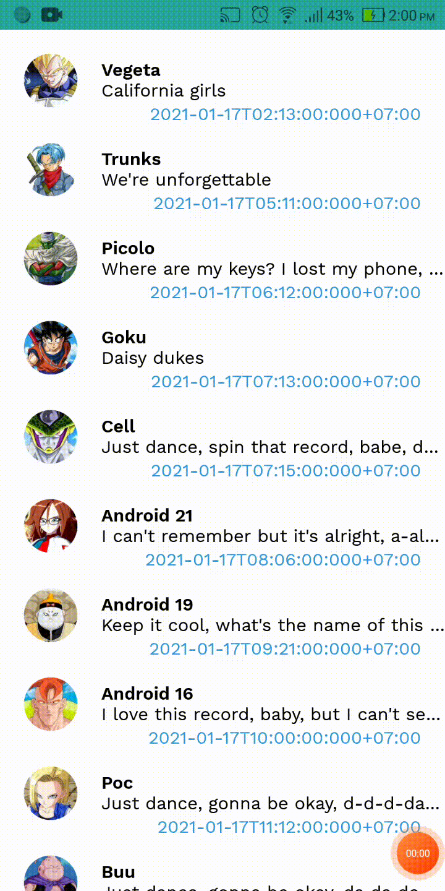

## Reruirement

By exist source code with a list item auto update every 1 second:
{:height="700px" width="400px"}

Use android concerning components of [ListAdapter](https://developer.android.com/reference/androidx/recyclerview/widget/ListAdapter)
Made list item animate update like this:
{:height="700px" width="400px"}
